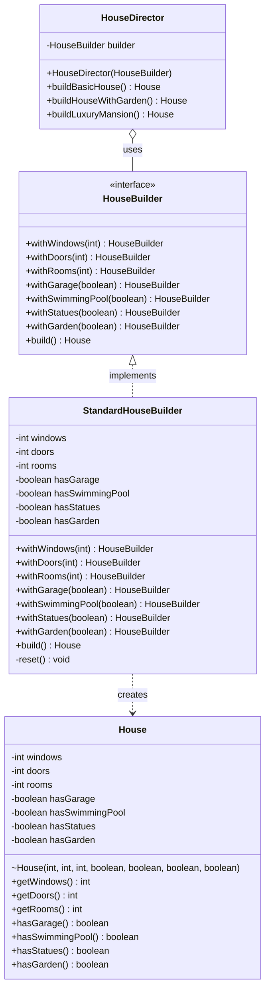
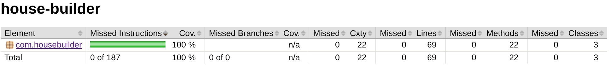

# House Builder

Ejercicio de patrones de diseño de Factoría F5. Implementa el patrón Builder sobre una entidad `House`, de forma que se puedan construir distintos tipos de casa sin arrastrar un constructor lleno de parámetros.

Java 21, Maven, JUnit 5 y JaCoCo.

## El problema

Una casa tiene ventanas, puertas, habitaciones y varios extras opcionales: garaje, piscina, estatuas y jardín. Si todo eso entra por el constructor, construir una casa con jardín queda así:

```java
new House(4, 2, 1, false, false, false, true);
```

Nadie sabe qué es ese `true` sin abrir la clase y contar posiciones. Y el día que aparezca la chimenea, todas las llamadas que ya existen dejan de compilar.

## La solución

El Builder separa la construcción del objeto de su representación. Se van indicando las características de una en una y, al final, se pide la casa:

```java
House house = new StandardHouseBuilder()
        .withWindows(4)
        .withDoors(2)
        .withGarden(true)
        .build();
```

Para las combinaciones que se repiten hay un director con las recetas ya hechas:

```java
HouseDirector director = new HouseDirector(new StandardHouseBuilder());

House basic   = director.buildBasicHouse();
House garden  = director.buildHouseWithGarden();
House mansion = director.buildLuxuryMansion();
```

## Diagrama de clases



## Las piezas

`House` es el producto. Todos sus campos son `final` y no tiene setters: una vez construida no cambia. Su constructor es *package-private*, así que desde fuera del paquete la única forma de conseguir una casa es a través del builder.

`HouseBuilder` es el contrato: los siete pasos de construcción más el `build()`. Cada paso devuelve `HouseBuilder`, y eso es lo que permite encadenar las llamadas.

`StandardHouseBuilder` es la implementación. Guarda los valores según se los van pidiendo y en `build()` fabrica la casa. Justo después llama a un `reset()` privado que deja los campos a cero, de modo que el mismo builder se puede reutilizar sin que la casa anterior contamine la siguiente.

`HouseDirector` guarda las recetas. No construye nada por su cuenta: recibe un `HouseBuilder` y le dicta los pasos. Como depende de la interface y no de la clase concreta, se le puede pasar cualquier otro builder sin tocar una línea del director.

## Cobertura

```bash
mvn test
```

El informe de JaCoCo queda en `target/site/jacoco/index.html`.



Siete tests cubren el 100% de las tres clases (187 instrucciones, 69 líneas, 22 métodos, ninguno sin ejecutar). El requisito del ejercicio era 70%.

## Estructura

```
src/main/java/com/housebuilder/
├── House.java
├── HouseBuilder.java
├── StandardHouseBuilder.java
└── HouseDirector.java

src/test/java/com/housebuilder/
├── StandardHouseBuilderTest.java
└── HouseDirectorTest.java
```
